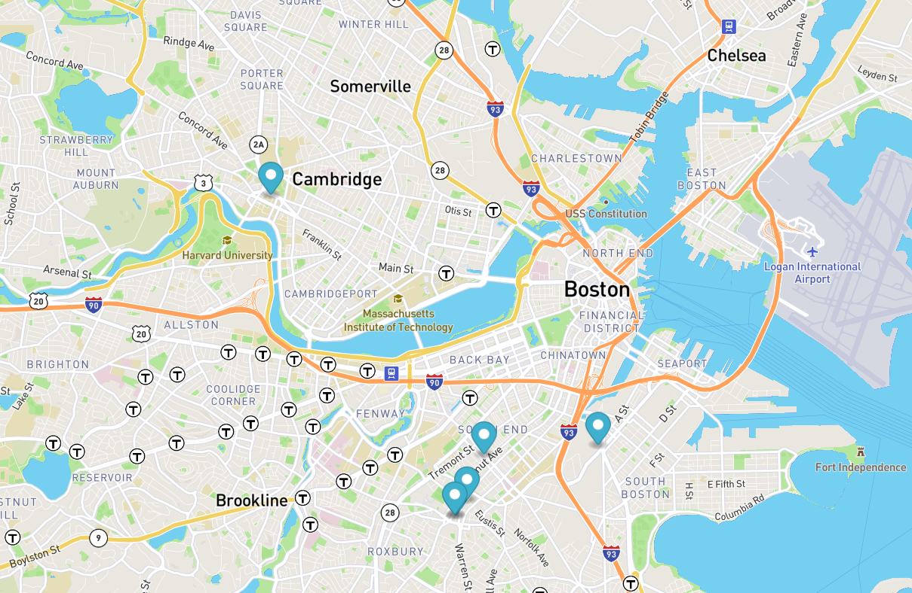

<button type="button">Click Me!</button>

<a href="https://leanneh11.github.io/LeanneH/" >BACK TO PORTFOLIO</a>

# Real Time Bus Tracker

**Description:**
This is week nine's JavaScript project to track buses on a Boston city map using HTML, CSS, and JavaScript.

**Image:**
 

**Installation:**
To install, please download the files to your laptop.  

**Usage:**
To use/execute, drag index.html onto the browser

**Support:**
You may contact me via GitHub

**License information:**
Licensed via the MIT XPRO JavaScript course.

 

